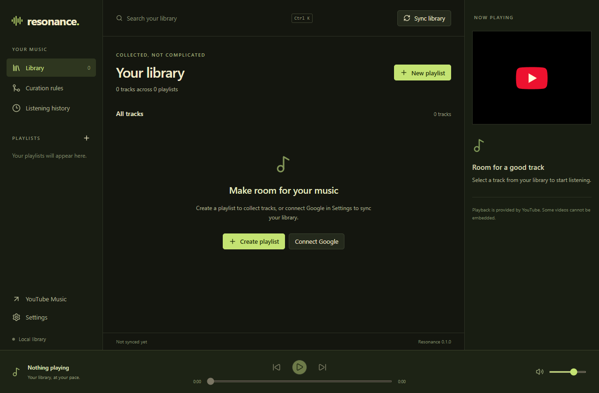

# Resonance

A Windows desktop application for collecting, playing, and curating YouTube playlists.

[](https://github.com/fabiouh/resonance/actions/workflows/ci.yml) [](LICENSE)



## Features

- Local playlists with YouTube link import, library search, and track context menus.
- Google sign-in through your browser; import owned YouTube playlists, create private playlists, and add or remove entries.
- Auto All curation rules merge source playlists into a target without duplicates. Tracks remain managed while any source references them; manually added entries are preserved.
- Preview curation changes before applying them, or enable periodic background synchronization.
- YouTube's embedded player, playback controls, and a local listening history.
- Optional Discord Rich Presence, a system tray menu, and signed application updates in configured release builds.

Resonance uses the YouTube Data API, not an unofficial YouTube Music API. Album libraries, recommendations, subscription downloads, and YouTube Music's full account history are not available. Some videos cannot be embedded; open those tracks in YouTube Music. Playlist deletion on YouTube is managed on YouTube itself.

## Installation

Download `Resonance_x.y.z_x64-setup.exe` from [Releases](https://github.com/fabiouh/resonance/releases) and run it. Rust, Node.js, and pnpm are not needed to use an installer. WebView2 is installed by the setup program when necessary.

Before the first published release, build from source. Successful `main` builds also provide a `resonance-windows-x64` artifact under [Actions](https://github.com/fabiouh/resonance/actions/workflows/ci.yml).

Windows 10/11 x64 is the supported platform. Installers are not Authenticode-signed; Windows may show a publisher warning. Updater signatures verify application updates and are separate from Windows publisher certificates.

## Development

Install Node.js 24, pnpm 10, stable Rust, Visual Studio C++ Build Tools with a Windows SDK, and WebView2. See [Tauri's Windows prerequisites](https://v2.tauri.app/start/prerequisites/#windows).

```sh
pnpm install --frozen-lockfile
pnpm tauri dev
```

```sh
pnpm validate                       # Formatting, checking, linting, tests, build
pnpm tauri build --debug --no-bundle
pnpm test:desktop                   # Native library and settings smoke test
pnpm tauri build                    # Release executable and NSIS installer
pnpm test:desktop:release           # Release startup smoke test
```

The browser preview requires the desktop application for storage and account operations. It does not include sample library data.

Keyboard shortcuts: `Ctrl+K` searches, `Ctrl+N` creates a playlist, `Space` toggles playback, and `Alt+Left` / `Alt+Right` skip tracks. Playback shortcuts apply outside form controls.

## Configuration

### Google

Local playlists and public video playback work without a Google connection.

For account synchronization:

1. Enable **YouTube Data API v3** in your Google Cloud project.
2. Configure the OAuth consent screen. Add your account as a test user while the project is in testing.
3. Create an OAuth client of type **Desktop app**.
4. Enter its client ID and client secret in Resonance's Settings, then choose **Sign in with Google**.
5. Choose **Sync library** to import playlists owned by that account.

The OAuth flow uses a loopback callback, state verification, and PKCE. Client secrets and refresh tokens are stored in Windows Credential Manager. No shared Google credentials are distributed with the application.

Google's test-mode token lifetime, consent requirements, playlist permissions, and daily API quotas still apply. Background synchronization defaults to off. Manual sync refreshes the library; the curation preview applies rules separately. Disconnecting removes saved credentials, converts cached playlists to local playlists, and pauses rules.

### Discord

Create an application in the [Discord Developer Portal](https://discord.com/developers/applications), enter its application ID in Settings, and enable listening activity. Keep the Discord desktop client running. Presence follows the embedded player and clears when playback pauses.

### Releases and updates

See [the release guide](docs/releases.md) for signing setup and the release checklist. Maintainers release from a clean, synchronized `main` branch:

```sh
pnpm release patch
pnpm release minor
pnpm release major
```

Each command validates, updates all version manifests, builds and checks the installer, commits the version bump, creates a tag, and atomically pushes the commit and tag. Ordinary commits never publish a release.

## Privacy

Resonance has no telemetry or hosted backend. Playlist data, settings, and listening history are stored in `library.sqlite` under the application's roaming AppData directory. Close Resonance before backing up this directory; SQLite's journal files may contain pending data.

YouTube receives video metadata, thumbnail, and playback requests. Account operations go directly to Google's APIs. Discord receives the current track only when Rich Presence is enabled. Configured release builds contact GitHub to check for updates.

Listening statistics cover time observed in the embedded player, in short intervals. They do not import your Google history or track playback in other applications. History can be cleared in the application. Disconnect Google and revoke its grant in your Google account to remove access fully.

## Contributing

See [CONTRIBUTING.md](CONTRIBUTING.md). Report vulnerabilities using [SECURITY.md](SECURITY.md).

## License

[MIT](LICENSE).
